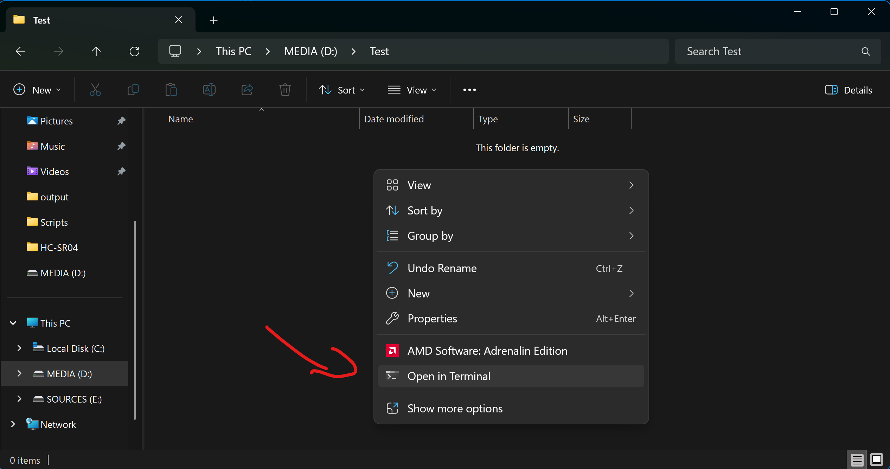
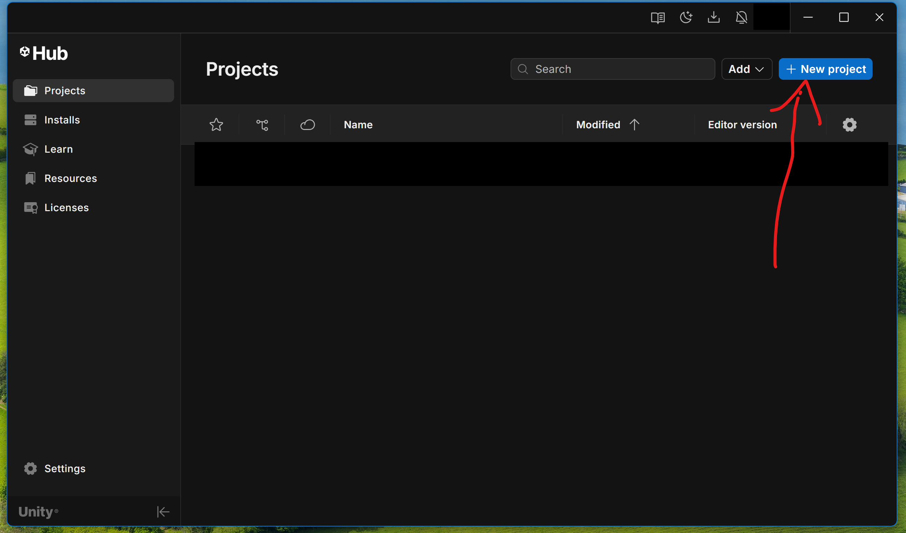
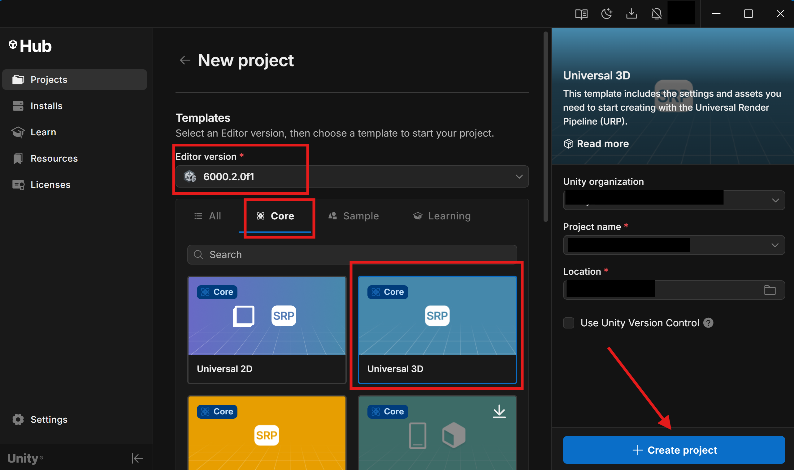
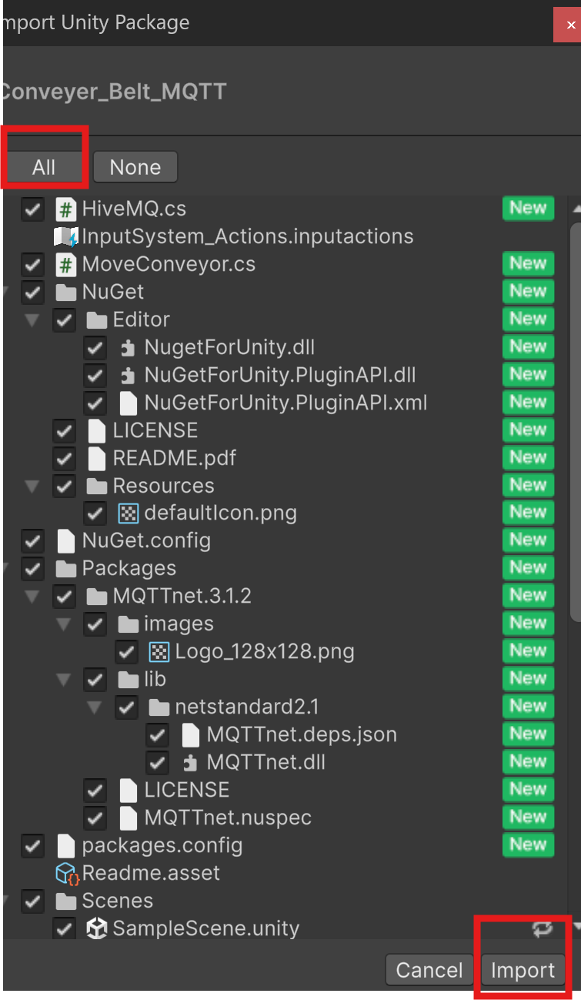
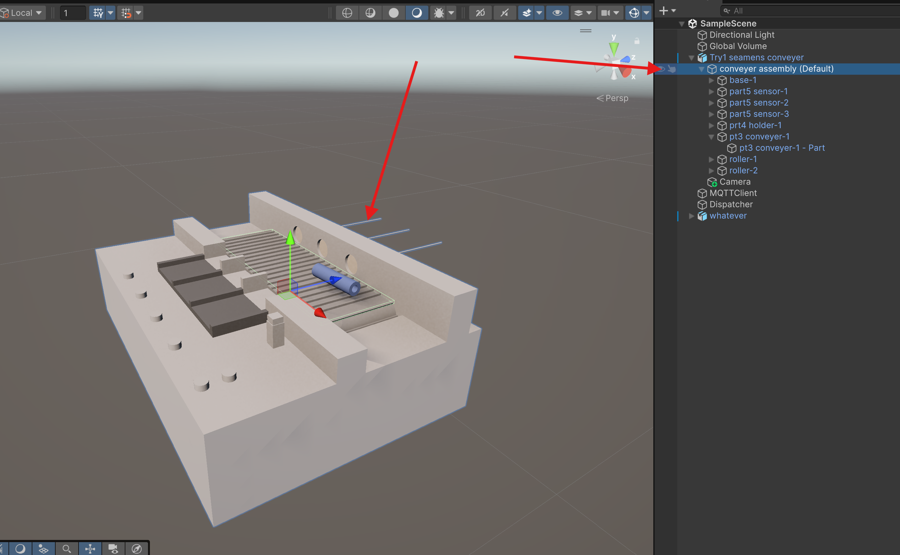

# 🏭 Unity Conveyor Belt + MQTT Digital Twin  

This project is a **Unity conveyor belt simulation** (based on the Siemens **6ZB2310**) 🛠️.  
It connects to the **ESP32** 💡 and talks through **HiveMQ Cloud (MQTT broker)** 🌍.  

It’s like a **digital twin**: you can send commands to the conveyor belt in Unity using real IoT messages 📡.  

---

## ✨ What’s Inside?
- 🎮 Conveyor belt model inside Unity  
- ☁️ Connection to **HiveMQ Cloud** (MQTT)  
- 🔌 ESP32 code that links with Unity  
- 📦 A ready `.unitypackage` so you can import easily  

---

## 📂 Repo Structure
```
.
├── Conveyer_Belt_MQTT.unitypackage   # Conveyor belt Unity package
├── Unity_codes/                      # Unity scripts & logic
├── connect_ESP32_with_Unity/         # ESP32 + MQTT connection code
├── images                            # Reference images
└── README.md                         # You’re reading this 😄
```

---

## 🧰 What You Need
- 🕹️ Unity (package is tested on unity editor ver. 6000 )  
- ⚡ ESP32 board  
- ☁️ A free [HiveMQ Cloud](https://www.hivemq.com/mqtt-cloud-broker/) account  
---

## 🚀 How to Run

Follow these steps step-by-step. Don’t skip anything!  

---

### 🖥️ Part 1: Prepare a Folder & Clone the Repo
1. On your computer, create a new folder (for example: `MQTT_Unity_Project`).  
2. Open that folder.  
3. **Right-click inside the folder** → choose **“Open Terminal”**.

5. Type this command to clone the repo into the folder:  
   ```bash
   git clone https://github.com/mahmoud-kafafy/Connect_Unity_with_MQTT_DigitalTwin.git
   
---

### 🎮 Part 2: Open Unity & Import Package
1. Open **Unity Hub**.  
2. Click **“New Project”** → choose **3D Core** → name it something like `ConveyorMQTT`.



4. Once Unity loads your empty project:  
   - Go to the **top menu bar** → `Assets → Import Package → Custom Package...`


   - Select the file: `Conveyer_Belt_MQTT.unitypackage` (found in the repo you cloned).  
   - Unity will show a list of assets → click **Import**.


5. Now you’ll see the conveyor belt assets in your project.  


---
### 📂 Part 3: Next Steps
The rest of the setup is explained in the project files:  

- 📝 **Unity_codes/** → contains Unity-side scripts & logic.  
- 📝 **connect_ESP32_with_Unity/** → contains ESP32 + MQTT code & instructions.  

👉 Follow the notes in each folder to finish connecting ESP32 ↔ HiveMQ ↔ Unity.  

---


## 🔗 Links & Credits
- 🏭 Siemens 6ZB2310 — Conveyor reference  
- ☁️ [HiveMQ Cloud](https://www.hivemq.com/mqtt-cloud-broker/)  
- 🎮 [Unity Docs](https://unity.com/)  

---

💡 Tip: Start small → first test MQTT with HiveMQ + Unity, then connect ESP32. Step by step makes life easier 🚦.  
